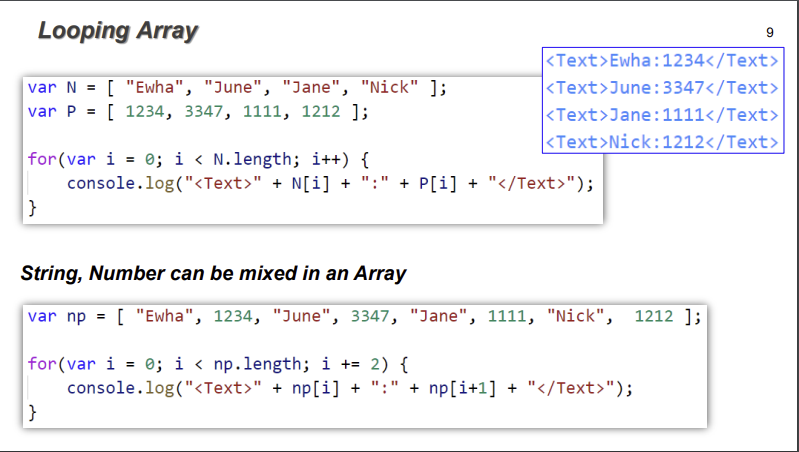
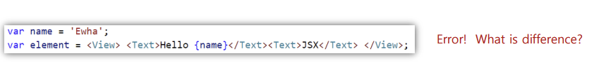

### 7. LOOP, ARRAY

    var x // undefined 상태. number or string을 대입하면 타입이 정해진다.
    x = "" //REVIEW: zero-length string. a valued value.
    x = undefined //REVIEW: \*다시 undefined 상태가 될 수 있다

array: 같은 타입의 데이터만 들어가 있다. 길이가 정해져 있다.
A = [1, 4, 9, 16, 25]
console.log(A);
console.log(A[4]); //25
console.log(A[5]); //REVIEW: undefined - 컴파일 에러가 나지 않는다
console.log(A.length); //REVIEW: in python: len(A) ... 문법은 자바, 데이터 형식은 파이썬
A.push(36);
A.pop();
Looping Array //TODO: 실습해보기 _number, string을 함께 사용할 수 있음_

list: 서로 다른 타입의 데이터도 들어갈 수 있다. 길이가 가변적이다.

---

### 8. JSX

    JS의 확장. HTML 태그를 number, string과 같은 제 3의 데이터 타입으로 이해한다.
    이때, 태그 사이에 JS 코드를 사용하면, {} 안에 적는다.
    - 하나의 태그(쌍)에 감싸 있어야 한다.
    - //REVIEW: 중첩된 태그 사이에서 띄어쓰기를 하면 에러가 난다! 그러나 줄바꿈은 에러가 나지 않는다 :rofl:

App()은 jsx 태그를 화면에 표시(랜더링)하는 함수이다. 함수와 변수 사용을 통해 화면은 동적이다.
