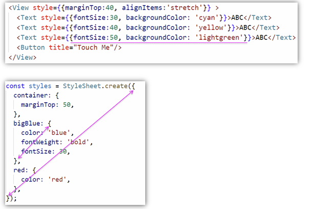
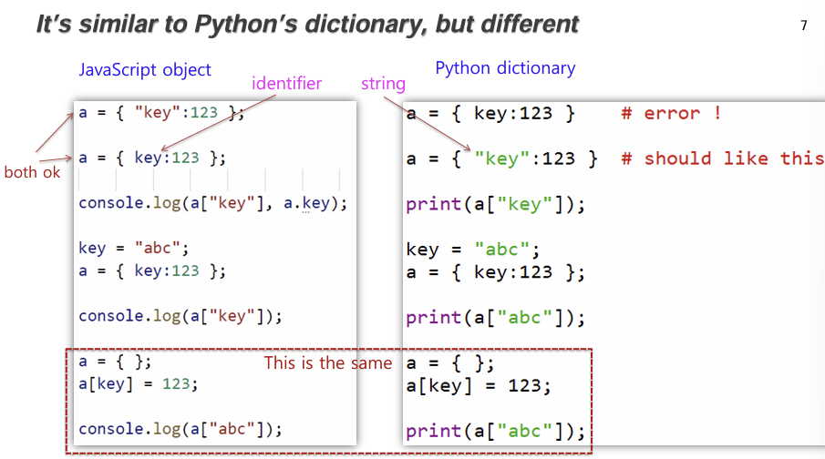
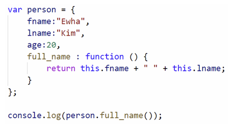
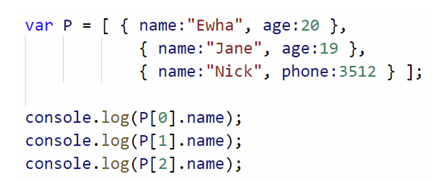

### JS OBJECT

var person = { }
person.fname = "Daj33"
person.lname = "Kim";=
var person = {fname: "Daj33", lname: "Kim"}
:star: property 값은 identifier이다. (python의 key와 대응)
:star2: 리액트 style은 object를 사용한다.

---

### Python Dictionary

var person = {"fname": "Daj33"}
:star: key 값은 string이다

---

### Are they Exactly same? NO!

1.  
    var key = "abc";
    var a = { key: 123 };
    console.log(a["key"]); //python: print(a["abc"]);
    a = {};
    a[key] = 123;
    console.log(a["abc"]); //python: print(a["abc"]);
    :star: 함수의 이름은 필요하지 않다
2.  Object can have Function - OOP 적용
    person.full_name = function (){
    return this.fname + " " + this.lname;
    }
    
    :star: 함수의 이름은 필요하지 않다

---

##### Array vs Object

array(list): [ value ] - index 자동 부여, index룰 통한 접근
object: { property: value } - property를 통한 접근

---

### Array of Objects

:star: object의 형식은 다를 수 있다
